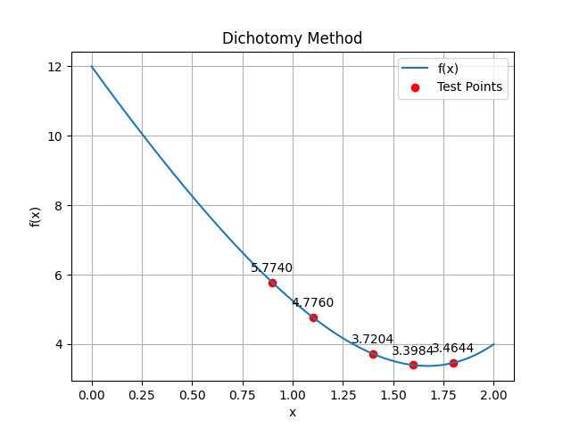

# Dichotomy Method (Interval Halving)

This method finds the minimum by repeatedly reducing the interval.

---

## Theoretical Breakdown

- Choose two points near midpoint:

\[
x_1 = \frac{a+b}{2} - \varepsilon, \quad
x_2 = \frac{a+b}{2} + \varepsilon
\]

- If:
  - \( f(x_1) < f(x_2) \) → new interval \([a, x_2]\)
  - else → \([x_1, b]\)

- Repeat until:
\[
|b - a| < \delta
\]

---

## Numerical Example

- **Function:**  
  \( f(x) = \frac{1}{4}x^4 + x^2 - 8x + 12 \)

- **Interval:** \([0, 2]\)  
- **ε = 0.1**

| Iteration | Interval | x₁ | x₂ | f(x₁) | f(x₂) |
|----------|---------|----|----|-------|-------|
| 1 | [0,2] | 0.9 | 1.1 | 5.07 | 4.49 |
| 2 | [0.9,2] | 1.4 | 1.6 | 3.61 | 3.54 |
| 3 | [1.4,2] | 1.6 | 1.8 | 3.54 | 3.73 |

**Result:** Minimum ≈ **x ≈ 1.6**

---

## Visualization

