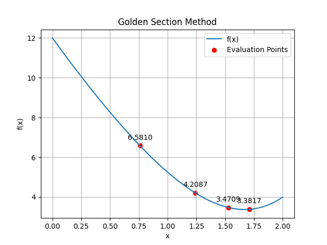

# Golden Section Method

An efficient optimization method using the golden ratio.

---

## Theoretical Breakdown

Golden ratio:

\[
\varphi = 1.618
\]

Points:

\[
x_1 = b - \frac{b-a}{\varphi}, \quad
x_2 = a + \frac{b-a}{\varphi}
\]

Update:

- If \( f(x_1) < f(x_2) \) → \( b = x_2 \)
- Else → \( a = x_1 \)

---

## Numerical Example

- **Function:**  
  \( f(x) = \frac{1}{4}x^4 + x^2 - 8x + 12 \)

- **Interval:** \([0, 2]\)

| Iteration | a | b | x₁ | x₂ |
|----------|---|---|----|----|
| 1 | 0 | 2 | 0.76 | 1.24 |
| 2 | 0.76 | 2 | 1.24 | 1.53 |
| 3 | 1.24 | 2 | 1.53 | 1.71 |

**Result:** Minimum ≈ **x ≈ 1.5**

---

## Visualization

